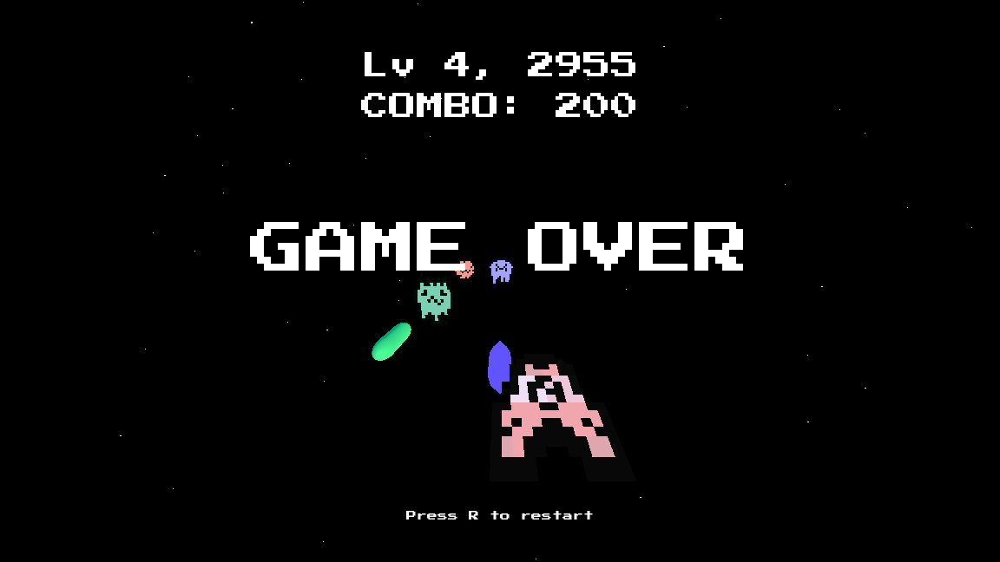

# 👾 Godot - Space War

>[!WARNING]
>#### 🦑 Early Development Build
>This project is in an early active-development stage and its foundation may not be fully formed. 
>This includes but is not limited to possible changes to the architecture and class APIs in the near future. 

This is an arcade shooter game being developed on [Godot 4](https://github.com/godotengine/godot) with the idea of synergies and content variety,
inspired by games like [The Binding of Isaac](https://store.steampowered.com/app/250900/The_Binding_of_Isaac_Rebirth) and [Inscryption](https://store.steampowered.com/app/1092790/Inscryption).

### Direction

This is a recreation of my older game jam project, with main goals being improved architecture and expandability. 
The planned gameplay mechanics are roughly outlined in the [progress section](#progress) and are subject to change.

### Progress

- [x] Foundation
- [ ] Playable
  - [x] [Early test build](https://github.com/JustKesha/godot-space-war/releases#release-v0.0.1)
  - [ ] UI/HUD
  - [ ] Polish
- [ ] Depth
  - [ ] Player / Enemy special abilities
    - [ ] Passive - Entity traits
    - [ ] Active - Entity actions
  - [ ] Stat system - Partly done

### Contribution

While this is a small passion project, any help would be welcomed. 
If you're new to Godot or just wanna learn more - you can contact me on [Discord](https://discord.gg/mh6ZwSSPcy).

#### Requirements

- Godot 4.7 or higher
- [Assets content](#-assets-content)

>[!NOTE]
>#### 🍦 Assets Content
>This repository does not contain the asset folder for this project. 
>A fresh version can be requested through the discord.

